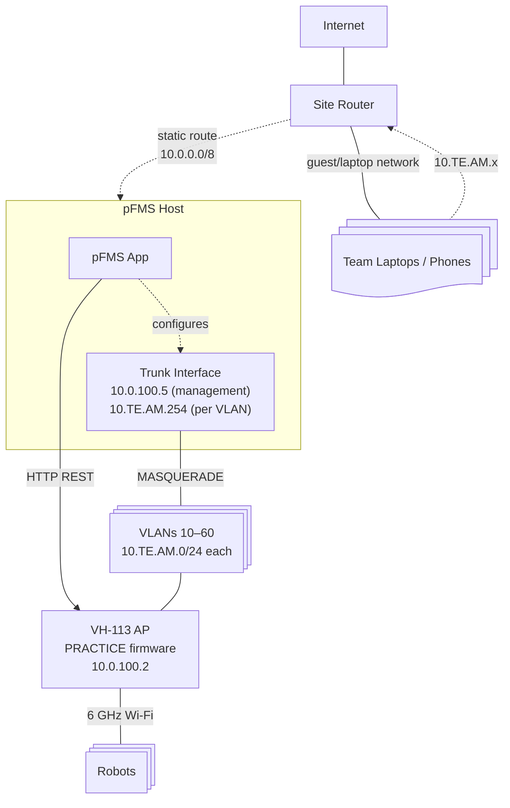

# Network Architecture

The VH-113 field radio runs **`PRACTICE`** (or `OFFSEASON`) AP firmware.
The AP handles DHCP on team VLANs directly; the pFMS host adds VLAN
interfaces and MASQUERADE rules to route traffic between team subnets and
the site network so laptops can reach robots and internet.



## Subnets

| Subnet        | CIDR            | Managed by    | Purpose                                               |
| ------------- | --------------- | ------------- | ----------------------------------------------------- |
| Main network  | (site-specific) | Site router   | Servers, infrastructure                               |
| Guest WiFi    | (site-specific) | Site router   | Team laptops, phones                                  |
| Field control | `10.0.100.0/24` | Static        | AP management, FMS                                    |
| Team VLANs    | `10.TE.AM.0/24` | **AP (DHCP)** | Per-team isolation (e.g. team 1234 → `10.12.34.0/24`) |

## pFMS Host Network Responsibilities

1. **VLAN interfaces** — trunk port carries VLANs 10–60 + 100; the OS
   creates sub-interfaces (e.g. `eth0.10`, `eth0.20`)
2. **VLAN IP** — assigns itself `10.TE.AM.254` (configurable via
   `VLAN_HOST_OCTET`) on each active team's VLAN as a routing anchor
3. **Inter-VLAN routing** — IP forwarding + MASQUERADE rules between team
   subnets and the site network
4. **Per-client route preferences** — `ip rule` entries steer individual
   laptop IPs to specific station VLANs (for duplicate team
   disambiguation)
5. **Radio configuration** — HTTP REST to `10.0.100.2`
6. **FMS protocol** — TCP/1750 + UDP/1160 for DS status; UDP/1121 for
   robot control packets
7. **DS↔RIO DNAT** — dynamic PREROUTING rules to route asymmetric RIO→DS
   UDP replies back to the DS laptop
8. **Syslog** — optional syslog server for radio log collection

> **OFFSEASON firmware:** the pFMS host also runs `dnsmasq` per VLAN to
> serve DHCP (gateway = `10.TE.AM.254`), since the AP does not.

## Routing: Guest WiFi ↔ Team Subnets

For laptops on the site's guest/laptop network to reach robots on team
subnets (`10.TE.AM.x`):

1. **Site router** needs a static route: `10.0.0.0/8` → the pFMS host's
   main IP (one-time config, team-agnostic)
2. **pFMS host** has direct access to team VLANs via trunk and routes
   between them and its main interface
3. **Teams** use hardcoded IPs (e.g. `10.12.34.2` for roboRIO) — no DNS
   needed

## Driver Station generations

pFMS speaks to both Driver Station generations on the same ports (TCP 1750
in, UDP 1160 in), telling them apart by the team-number handshake each one
sends when it connects:

|                          | NI FRC Driver Station (roboRIO)   | 2027 FIRST Driver Station (SystemCore)                             |
| ------------------------ | --------------------------------- | ------------------------------------------------------------------ |
| Handshake DS → FMS       | tag `0x18`, team as 2 bytes       | tag `0x1e`: UDP reply port, flags, team as ASCII                   |
| Assignment FMS → DS      | tag `0x19` (station, status)      | tag `0x1f` (station, status, flags, team)                          |
| Control packets FMS → DS | UDP **1121** (1120 = "ask first") | the UDP port named in the handshake — a new one on every reconnect |
| Game data                | UDP tag `0x07`                    | UDP tag `0x20`, max 8 characters                                   |

Control packets to the 2027 DS must come **from** the FMS's UDP port 1160;
it ignores them from any other port. It never sets the "enabled" bit in its
status, even while the robot runs. During a live match its TCP traffic was
only `0x1e` handshakes and `0x1d` keepalives. Whether a Disable pressed on
the DS reaches pFMS is untested.

Seen between a 2027 DS and a SystemCore robot on the field: UDP 1110 in
both directions (the robot replies to the DS's source port, so NAT works
without extra forwarding), UDP 1150, and TCP 1250, 1740 and 5810.

The station-assignment reply puts the DS in FMS-controlled mode. Joined
stations get their alliance slot; a DS that isn't in the match gets a
"release" reply so it can be driven locally, unless an admin turns off
out-of-match control.

The 2027 DS only includes
FMS support in its Windows build. Reference for the new format: Cheesy
Arena `field/driver_station_connection.go`.

## Host tuning pFMS applies

At startup pFMS enables IP forwarding and raises the kernel neighbor (ARP)
table limits (`net.ipv4.neigh.default.gc_thresh1/2/3` = 2048/4096/8192, and
the IPv6 equivalents). The device-discovery scanner sweeps every configured
team /24 every 10 s, which parks ~250 unresolved entries per slot for a
minute; Ubuntu's default ceiling of 1024 overflowed with four teams and a
full table silently drops packets to any host without an entry (2026-09-13:
three Driver Stations lost their robots mid-match). If `dmesg` shows
`neighbour: arp_cache: neighbor table overflow!`, this is what it means.
Don't fix it by slowing the scanner — that only delays the overflow; the
table size is the fix.

## DS ↔ RIO UDP and Dynamic DNAT

The FRC Driver Station ↔ roboRIO UDP protocol uses **asymmetric ports**:
the DS sends to the RIO on port 1110 (1115 when FMS-connected), but the
RIO replies to the DS on port **1150** with an unrelated source port. This
breaks conntrack-based NAT (MASQUERADE), which expects replies on the same
port pair.

**TCP traffic (NetworkTables, AdvantageScope)** works fine through
MASQUERADE because TCP's handshake creates a proper conntrack entry.

To fix DS ↔ RIO UDP, pFMS dynamically adds PREROUTING DNAT rules when a
DS connects:

```
iptables -t nat -A PREROUTING -i eth0.slot1 -p udp -d 10.TE.AM.254 \
  -j DNAT --to-destination <ds-laptop-ip>
```

This catches all UDP packets from the robot destined for the gateway IP on
the station's VLAN interface and rewrites the destination to the DS
laptop's guest WiFi IP. The rule is scoped to the gateway IP to avoid
catching multicast/broadcast traffic. The rule is:

- **Added** when the DS announces itself via TCP 1750 and its station is
  resolved
- **Persistent** across DS TCP reconnects (the DS flaps every ~6 s when no
  match is running)
- **Removed** when the station's team assignment is cleared or changed
- **Cleaned up** on hard restart via the `pfms-` comment prefix (same as
  all other rules)
- **Preserved** across graceful restarts (SIGHUP / `systemctl reload`);
  restored from kernel iptables on startup so stale rules are properly
  cleaned up if a DS reconnects with a different IP

## Duplicate Team Handling

When the same team is assigned to multiple stations (e.g., two robots from
team 1234):

- **DS address resolution** uses the kernel ARP/neighbor table
  (`ip neigh`) to identify which VLAN (station) a packet came from,
  instead of relying on team number alone. For unique team numbers (the
  common case), the lookup is a direct map check with no subprocess
  overhead.
- **Route page** (`/route`) lets laptops choose which station's robot they
  connect to. Selecting a station adds an
  `ip rule from <laptop-ip> lookup <vlan-table>` kernel rule directing
  that laptop's traffic through the chosen station's VLAN. Preferences are
  cleared when station configs change, to prevent stale rules pointing at
  removed routing tables.

## Device Discovery

The backend periodically scans each configured team's subnet using
`fping`, pinging `.1–.253` every 10 seconds. Discovered devices (IPs that
have responded at least once) are tracked with up/down status and
first/last-seen timestamps, and broadcast to frontend clients. Results
appear in the **Discovered Devices** section on the Network page and are
cleared when station config is cleared.

### Guest Host Names

Guest-network hosts (DS laptops, phones) are shown by device name wherever
they appear — Discovered Devices, DS chips, "Multiple DSes Detected"
warnings — with the IP shown alongside and used as the fallback when no
name is known. Since the site router owns guest DHCP (no lease file to
read), the backend asks each host directly, in parallel:

- an mDNS reverse PTR query (unicast to UDP 5353 — answered by
  Windows 10+, macOS, iOS, Linux),
- a NetBIOS node-status query (UDP 137 — answered by Windows DS laptops),
- and a reverse-DNS lookup through the system resolver (works when the
  site router registers DHCP client names).

Names are cached (`src/hostnameResolver.ts`) and pushed to clients as a
`hostnames` broadcast.

## mDNS Reflector

With `MDNS_REFLECTOR=true` (requires `VLAN_INTERFACE`), the backend
bridges `.local` queries between the main network and team VLANs so
laptops can resolve `roboRIO-TEAM-FRC.local` across the routed boundary.
`MDNS_EXCLUDE_REQUESTERS` and `MDNS_LISTEN_INTERFACES` tune which
requesters and interfaces participate.

## Physical Field Ports

With `FIELD_PORTS` configured (e.g. `201:Port A,202:Port B`), teams can
request a physical Ethernet port from their team control page. The port's
VLAN sub-interface is added as a second member of the station's bridge, so
a laptop plugged into that switch port is on the same L2 segment as the
radio VLAN and can reach the robot directly.
