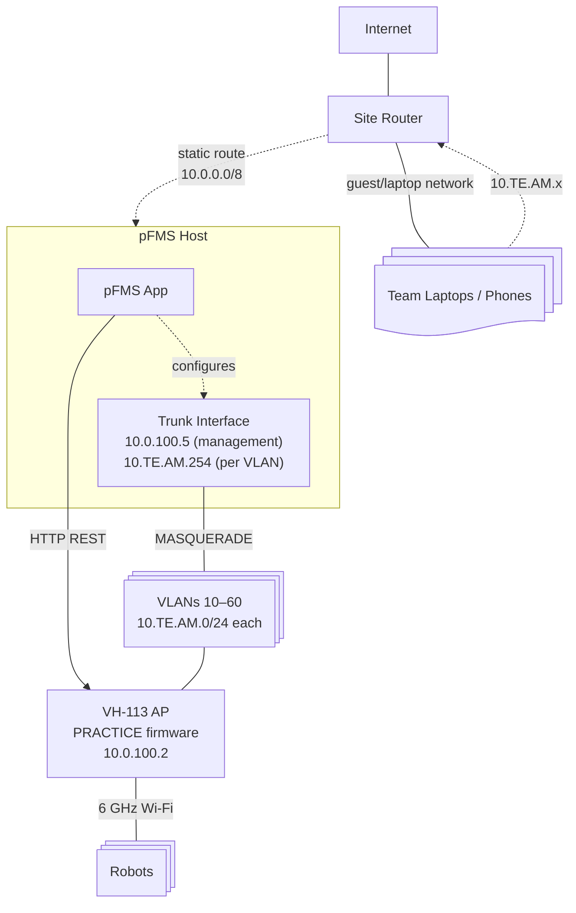

# Network Architecture

The VH-113 field radio runs **`PRACTICE`** (or `OFFSEASON`) AP firmware.
The AP handles DHCP on team VLANs directly; the pFMS host adds VLAN
interfaces and MASQUERADE rules to route traffic between team subnets and
the site network so laptops can reach robots and internet.


```mermaid
graph TD
    Internet["Internet"]
    Router["Site Router"]
    Laptops@{ shape: docs, label: "Team Laptops / Phones"}

    subgraph pFMS["pFMS Host"]
        APP["pFMS App"]
        TRUNK["Trunk Interface<br/>10.0.100.5 (management)<br/>10.TE.AM.254 (per VLAN)"]
        APP -. "configures" .-> TRUNK
    end

    AP["VH-113 AP<br/>PRACTICE firmware<br/>10.0.100.2"]
    Robots@{ shape: st-rect, label: "Robots"}
    VLANs@{ shape: st-rect, label: "VLANs 10–60<br/>10.TE.AM.0/24 each"}

    Internet --- Router
    Router -. "static route<br/>10.0.0.0/8" .-> pFMS

    APP -- "HTTP REST" --> AP
    TRUNK -- "MASQUERADE" --- VLANs --- AP
    AP -- "6 GHz Wi-Fi" --- Robots

    Laptops -. "10.TE.AM.x" .-> Router
    Router -- "guest/laptop network" --- Laptops
```

## Subnets

| Subnet        | CIDR            | Managed by    | Purpose                                               |
| ------------- | --------------- | ------------- | ----------------------------------------------------- |
| Main network  | (site-specific) | Site router   | Servers, infrastructure                               |
| Guest WiFi    | (site-specific) | Site router   | Team laptops, phones                                  |
| Field control | `10.0.100.0/24` | Static        | AP management, FMS                                    |
| Team VLANs    | `10.TE.AM.0/24` | **AP (DHCP)** | Per-team isolation (e.g. team 1234 → `10.12.34.0/24`) |

## pFMS Host Network Responsibilities

1. **VLAN interfaces** — trunk port carries VLANs 10–60 + 100; the OS
   creates sub-interfaces (e.g. `eth0.10`, `eth0.20`)
2. **VLAN IP** — assigns itself `10.TE.AM.254` (configurable via
   `VLAN_HOST_OCTET`) on each active team's VLAN as a routing anchor
3. **Inter-VLAN routing** — IP forwarding + MASQUERADE rules between team
   subnets and the site network
4. **Per-client route preferences** — `ip rule` entries steer individual
   laptop IPs to specific station VLANs (for duplicate team
   disambiguation)
5. **Radio configuration** — HTTP REST to `10.0.100.2`
6. **FMS protocol** — TCP/1750 + UDP/1160 for DS status; UDP/1121 for
   robot control packets
7. **DS↔RIO DNAT** — dynamic PREROUTING rules to route asymmetric RIO→DS
   UDP replies back to the DS laptop
8. **Syslog** — optional syslog server for radio log collection

> **OFFSEASON firmware:** the pFMS host also runs `dnsmasq` per VLAN to
> serve DHCP (gateway = `10.TE.AM.254`), since the AP does not.

## Routing: Guest WiFi ↔ Team Subnets

For laptops on the site's guest/laptop network to reach robots on team
subnets (`10.TE.AM.x`):

1. **Site router** needs a static route: `10.0.0.0/8` → the pFMS host's
   main IP (one-time config, team-agnostic)
2. **pFMS host** has direct access to team VLANs via trunk and routes
   between them and its main interface
3. **Teams** use hardcoded IPs (e.g. `10.12.34.2` for roboRIO) — no DNS
   needed

## Driver Station generations

pFMS speaks to both Driver Station generations on the same ports (TCP 1750
in, UDP 1160 in), telling them apart by the team-number handshake each one
sends when it connects:

|                          | NI FRC Driver Station (roboRIO)   | 2027 FIRST Driver Station (SystemCore)                             |
| ------------------------ | --------------------------------- | ------------------------------------------------------------------ |
| Handshake DS → FMS       | tag `0x18`, team as 2 bytes       | tag `0x1e`: UDP reply port, flags, team as ASCII                   |
| Assignment FMS → DS      | tag `0x19` (station, status)      | tag `0x1f` (station, status, flags, team)                          |
| Control packets FMS → DS | UDP **1121** (1120 = "ask first") | the UDP port named in the handshake — a new one on every reconnect |
| Game data                | UDP tag `0x07`                    | UDP tag `0x20`, max 8 characters                                   |

Control packets to the 2027 DS must come **from** the FMS's UDP port 1160.
Sent from an ephemeral port, the DS showed "connected" but never enabled and
sent no status back; from 1160 it worked. It never sets the "enabled" bit in its
status, even while the robot runs. During a live match its TCP traffic was
only `0x1e` handshakes and `0x1d` keepalives. Whether a Disable pressed on
the DS reaches pFMS is untested.

Seen between a 2027 DS and a SystemCore robot on the field: UDP 1110 in
both directions (the robot replies to the DS's source port, so NAT works
without extra forwarding), UDP 1150, and TCP 1250, 1740 and 5810.

The station-assignment reply puts the DS in FMS-controlled mode: its Enable
button disappears. pFMS only sends it for a station the field is
controlling: one joined to a match, or one held out of a match (below). Every
other DS gets **no reply**, keeps its own Enable/Disable, and retries the TCP
connection every ~8 s. Leaving a match drops the DS's connection, so it
reconnects, gets no reply and is back in local control within seconds.

From 2026-09-15 to 2026-10-04 a DS out of a match got a status-2 "not in
match" reply instead (what Cheesy Arena sends). Every DS 26.0 takes that as
"connected, waiting" and hides Enable. It went unnoticed because the DS's
`[ ] \` enable key combo still enables with the button hidden
(`plans/csa-fms-control-status.md`). If a DS out of a match keeps streaming
status to the field (it still thinks it is under FMS control), pFMS drops its
connection again and logs it.

A second laptop for a robot another laptop is driving gets no reply either:
it is held off the robot's network anyway, and an assignment would lock it.

When staff set "Freeplay outside matches" to **Held**, an unjoined DS is
instead assigned a slot (FMS-controlled) and held with a stream of disabled
packets whose game data reads `Admin disabled` (`AdminOff` on the 2027 DS,
which shows at most 8 characters), the same mechanism that holds a
policy-blocked control system (`Blocked`). Flipping the switch re-handshakes
every unjoined DS so it takes effect at once. Joining a match lifts the hold.

**E-stop** reaches robots out of a match too. While a station is e-stopped
(E-STOP ALL, the station's e-stop, or its DS's own), pFMS drops every DS→robot
control packet (UDP 1110) going into that station's bridge
(`FORWARD -o br-slotN -p udp --dport 1110 -j DROP`, comment
`pfms-estop-slotN`). A robot disables its outputs ~100 ms after its control
packets stop, whatever its DS thinks. Robot→DS traffic still flows, so the
field keeps seeing the robot. An unjoined DS is also taken under field control
like a held one (game data `E-Stop`). Both last until staff clear the e-stop
(admin page "Clear all e-stops", or per station on the match page). Startup
removes any leftover cut, since no station starts e-stopped.

The team's pages offer the same cut out of a match: **Stop robot** (a team
can stop its robot even when its Driver Station doesn't respond) and **Let it
drive again**. A team Stop doesn't take the DS under field control. The DS
just loses the robot, drops to disabled, and the team enables from it again
once they let the robot drive. Joining a match clears a team Stop; in a match
the team's console has Disable and E-Stop instead.

The 2027 DS only includes
FMS support in its Windows build. Reference for the new format: Cheesy
Arena `field/driver_station_connection.go`.

## Host tuning pFMS applies

At startup pFMS enables IP forwarding and raises the kernel neighbor (ARP)
table limits (`net.ipv4.neigh.default.gc_thresh1/2/3` = 2048/4096/8192, and
the IPv6 equivalents). The device-discovery scanner sweeps every configured
team /24 every 10 s, which parks ~250 unresolved entries per slot for a
minute; Ubuntu's default ceiling of 1024 overflowed with four teams and a
full table silently drops packets to any host without an entry (2026-09-13:
three Driver Stations lost their robots mid-match). If `dmesg` shows
`neighbour: arp_cache: neighbor table overflow!`, this is what it means.
Don't fix it by slowing the scanner — that only delays the overflow; the
table size is the fix.

When a Driver Station says it's connected to FMS but the robot never
enables, the journal should show, in order: `DS at <ip>: team N (2027 DS,
control UDP P, flags 0) → assigned <slot>`, then `Match control for <slot>
now sent to <ip>:P/ds2027` **once** rather than every 3 s, then `DS attached
to FMS: <slot>`. To watch the wire:
`sudo tcpdump -i <trunk> -nn -X "host <ip> and udp"`.

Two things that look like faults and aren't: the 2027 DS reconnects its TCP
session every ~3 s while assigned (~5 s while not), advertising a fresh
control port each time — Cheesy Arena doesn't special-case it either, so it
appears to be inherent. And `dhcpcd`'s `route socket overflowed … drained N
messages` is collateral from neighbor-table churn, not a DHCP fault.

A Driver Station is not always behind its slot's NAT gateway: one team's DS
traffic has been seen arriving from an address on another subnet entirely,
with robots driving fine. Don't assume the slot gateway address when
matching a DS to a station.

## DS ↔ RIO UDP and Dynamic DNAT

The FRC Driver Station ↔ roboRIO UDP protocol uses **asymmetric ports**:
the DS sends to the RIO on port 1110 (1115 when FMS-connected), but the
RIO replies to the DS on port **1150** with an unrelated source port. This
breaks conntrack-based NAT (MASQUERADE), which expects replies on the same
port pair.

**TCP traffic (NetworkTables, AdvantageScope)** works fine through
MASQUERADE because TCP's handshake creates a proper conntrack entry.

To fix DS ↔ RIO UDP, pFMS dynamically adds PREROUTING DNAT rules when a
DS connects:

```
iptables -t nat -A PREROUTING -i eth0.slot1 -p udp -d 10.TE.AM.254 \
  -j DNAT --to-destination <ds-laptop-ip>
```

This catches all UDP packets from the robot destined for the gateway IP on
the station's VLAN interface and rewrites the destination to the DS
laptop's guest WiFi IP. The rule is scoped to the gateway IP to avoid
catching multicast/broadcast traffic.

### Drive sessions belong to the robot, not the slot

Which laptop drives which robot is a _drive session_
(`src/driveSessions.ts`). It is keyed by the robot's SSID and the laptop's
IP, never by slot. The slot a robot is on is looked up from the radio config
only when a rule is built on that slot's bridge.

- **Starting.** A laptop announces its team number in every DS handshake and
  UDP status. When that team has exactly one robot on the field, the laptop
  drives it. With two robots of one team, the laptop picks one with the Drive
  button on its team page (or `/route`).
- **Kernel state is derived.** From the sessions and the current radio
  config, pFMS works out which DNAT rules, duplicate-DS blocks and route
  preferences should exist, and one serialised sync adds or removes the
  difference. It runs on every change and every 5 seconds, so a burst of
  handshakes cannot create duplicate rules, a failed iptables call is
  retried, and anything that drifts heals.
- **A slot changing hands needs no special case.** The previous robot is no
  longer on any slot, so its session ends and its rules go; the new robot
  has no session, so its team's laptop takes it. The previous team's laptop
  can keep handshaking from the guest Wi-Fi without effect. When this was
  keyed by slot, that laptop kept the slot, the new team's only laptop was
  refused as a "duplicate DS", and joining a match handed control to the old
  laptop (2026-09-27, slots 1 and 4).
- **A robot moving slots keeps its laptop**, and its rules follow it.
- **"Multiple DSes"** means a second laptop for the same robot. It is held
  off the robot's VLAN with a FORWARD drop and told so in its game data,
  until the first laptop goes quiet or the second disconnects.
- **Persistent** across DS TCP reconnects (the DS flaps every ~6 s when no
  match is running). A session ends when its laptop has said nothing for
  20 s, when its robot leaves the field, or when the laptop's DS is switched
  to another team.
- **Cleaned up** on hard restart via the `pfms-` comment prefix (same as
  all other rules).
- **Preserved** across graceful restarts (SIGHUP / `systemctl reload`): DNAT
  rules found in the kernel become sessions again when the robot on their
  slot is still of that team, so robots stay connected. Anything else found
  there (rules for robots that left, duplicate copies, leftover blocks) is
  removed.

The match engine still records a Driver Station per station; the drive
sessions keep it in step, so a station shows the laptop of the robot on it
now.

## Duplicate Team Handling

When the same team is assigned to multiple stations (e.g., two robots from
team 1234):

- **DS address resolution** uses the kernel ARP/neighbor table
  (`ip neigh`) to identify which VLAN (station) a packet came from,
  instead of relying on team number alone. For unique team numbers (the
  common case), the lookup is a direct map check with no subprocess
  overhead.
- **Route page** (`/route`) lets laptops choose which station's robot they
  connect to. Selecting a station adds an
  `ip rule from <laptop-ip> lookup <vlan-table>` kernel rule directing
  that laptop's traffic through the chosen station's VLAN. Preferences are
  cleared when station configs change, to prevent stale rules pointing at
  removed routing tables.

## Device Discovery

The backend periodically scans each configured team's subnet using
`fping`, pinging `.1–.253` every 10 seconds. Discovered devices (IPs that
have responded at least once) are tracked with up/down status and
first/last-seen timestamps, and broadcast to frontend clients. Results
appear in the **Discovered Devices** section on the Network page and are
cleared when station config is cleared.

### Guest Host Names

Guest-network hosts (DS laptops, phones) are shown by device name wherever
they appear — Discovered Devices, DS chips, "Multiple DSes Detected"
warnings — with the IP shown alongside and used as the fallback when no
name is known. Since the site router owns guest DHCP (no lease file to
read), the backend asks each host directly, in parallel:

- an mDNS reverse PTR query (unicast to UDP 5353 — answered by
  Windows 10+, macOS, iOS, Linux),
- a NetBIOS node-status query (UDP 137 — answered by Windows DS laptops),
- and a reverse-DNS lookup through the system resolver (works when the
  site router registers DHCP client names).

Names are cached (`src/hostnameResolver.ts`) and pushed to clients as a
`hostnames` broadcast.

## mDNS Reflector

With `MDNS_REFLECTOR=true` (requires `VLAN_INTERFACE`), the backend
bridges `.local` queries between the main network and team VLANs so
laptops can resolve `roboRIO-TEAM-FRC.local`, `radio.local`,
`limelight.local` and the like across the routed boundary.
`MDNS_EXCLUDE_REQUESTERS` and `MDNS_LISTEN_INTERFACES` tune which
requesters and interfaces participate.

It is a per-laptop bridge, not a flood:

- **A query is forwarded only to the VLAN of the station that laptop is
  placed on** — its route preference. That preference comes from pressing
  "Drive this robot", from the Driver Station's FMS handshake, or from the
  subnet scanner noticing (in conntrack, every 10 s) that the laptop is
  talking to a team subnet. A laptop that can't be placed gets nothing
  forwarded until it connects to something in its `10.TE.AM.x` range.
- **An answer is sent unicast back to the laptop(s) that asked**, matched
  by name against the questions forwarded in the last few seconds. Nothing
  is multicast onto the laptop networks, and unsolicited announcements are
  dropped. This is what lets several robots share a name: every radio is
  `radio.local`, and a flooded answer from one team used to land in every
  laptop's cache.

## Physical Field Ports

With `FIELD_PORTS` configured (e.g. `201:Port A,202:Port B`), teams can
request a physical Ethernet port from their team control page. The port's
VLAN sub-interface is added as a second member of the station's bridge, so
a laptop plugged into that switch port is on the same L2 segment as the
radio VLAN and can reach the robot directly.
